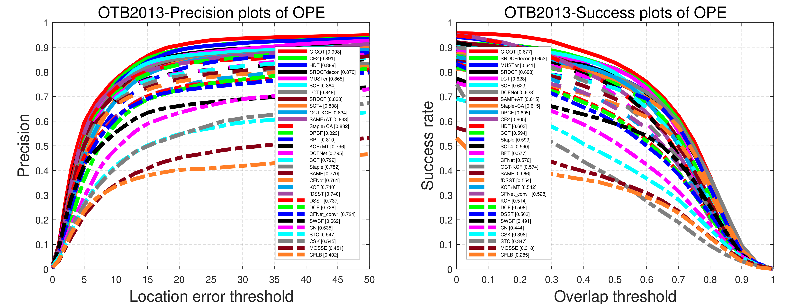
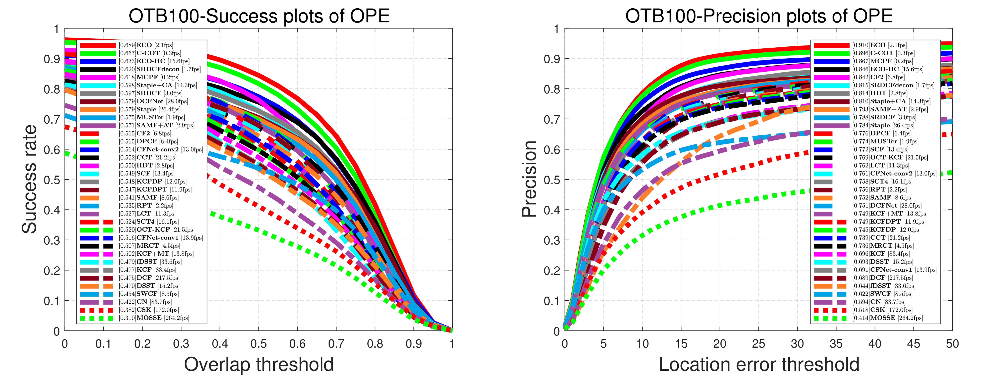

# Benchmark Results of Correlation Filters

Collect and share results for **correlation filter trackers**.

## Results on OTB

* All results run on a 3.5GHz Intel Core i7 CPU with 32 GB memory.
* We use the first frame's ground truth instead of the second frame's in the code of **HDT**. So there may be a gap between the result above and the paper.
* You can find more plots in the [OTB code folder](https://github.com/HakaseH/CF_benchmark_results/tree/master/codes/OTB) of the repository.

<!-- ## Results on UAV123

- coming... -->

# Papers & Codes

## Baseline

* **MOSSE:** David S. Bolme, J. Ross Beveridge, Bruce A. Draper, Yui Man Lui.
"Visual Object Tracking using Adaptive Correlation Filters." ICCV (2010).
[[paper](http://citeseerx.ist.psu.edu/viewdoc/download?doi=10.1.1.294.4992&rep=rep1&type=pdf)]
[[project](http://www.cs.colostate.edu/~vision/ocof_toolset_2012/index.php)]

* **CSK:** João F. Henriques, Rui Caseiro, Pedro Martins, Jorge Batista.
"Exploiting the Circulant Structure of Tracking-by-detection with Kernels." ECCV (2012).
[[paper](http://www.robots.ox.ac.uk/~joao/publications/henriques_eccv2012.pdf)]
[[project](http://www.robots.ox.ac.uk/~joao/circulant/)]

* **STC:** Kaihua Zhang, Lei Zhang, Ming-Hsuan Yang, David Zhang.
"Fast Tracking via Spatio-Temporal Context Learning." ECCV (2014).
[[paper](http://arxiv.org/pdf/1311.1939v1.pdf)]
[[project](http://www4.comp.polyu.edu.hk/~cslzhang/STC/STC.htm)]

* **KCF/DCF:** João F. Henriques, Rui Caseiro, Pedro Martins, Jorge Batista.
"High-Speed Tracking with Kernelized Correlation Filters." TPAMI (2015).
[[paper](http://www.robots.ox.ac.uk/~joao/publications/henriques_tpami2015.pdf)]
[[project](http://www.robots.ox.ac.uk/~joao/circulant/)]

## Color

* **CN:** Martin Danelljan, Fahad Shahbaz Khan, Michael Felsberg and Joost van de Weijer.
"Adaptive Color Attributes for Real-Time Visual Tracking." CVPR (2014).
[[paper](http://www.cvl.isy.liu.se/research/objrec/visualtracking/colvistrack/CN_Tracking_CVPR14.pdf)]
[[project](http://www.cvl.isy.liu.se/research/objrec/visualtracking/colvistrack/index.html)]

* **MOCA:** Guibo Zhu, Jinqiao Wang, Yi	Wu, Xiaoyu Zhang, Hanqing Lu.
"MC-HOG Correlation Tracking with Saliency Proposal." AAAI (2016).
[[paper](http://www.aaai.org/ocs/index.php/AAAI/AAAI16/paper/download/11986/12148)]

* **Staple:** Luca Bertinetto, Jack Valmadre, Stuart Golodetz, Ondrej Miksik, Philip H.S. Torr.
"Staple: Complementary Learners for Real-Time Tracking." CVPR (2016).
[[paper](http://arxiv.org/pdf/1512.01355v2.pdf)]
[[project](http://www.robots.ox.ac.uk/~luca/staple.html)]
[[github](https://github.com/bertinetto/staple)]

## Scale

* **DSST:** Martin Danelljan, Gustav Häger, Fahad Shahbaz Khan and Michael Felsberg.
"Accurate Scale Estimation for Robust Visual Tracking." BMVC (2014).
[[paper](http://www.cvl.isy.liu.se/research/objrec/visualtracking/scalvistrack/ScaleTracking_BMVC14.pdf)]
[[project](http://www.cvl.isy.liu.se/en/research/objrec/visualtracking/scalvistrack/index.html)]

* **fDSST:** Martin Danelljan, Gustav Häger, Fahad Khan, Michael Felsberg.
"Discriminative Scale Space Tracking." TPAMI (2017).
[[paper](http://www.cvl.isy.liu.se/research/objrec/visualtracking/scalvistrack/DSST_TPAMI.pdf)]
[[project](http://www.cvl.isy.liu.se/en/research/objrec/visualtracking/scalvistrack/index.html)]

* **SAMF:** Yang Li, Jianke Zhu.
"A Scale Adaptive Kernel Correlation Filter Tracker with Feature Integration." ECCV workshop (2014).
[[paper](https://github.com/ihpdep/ihpdep.github.io/raw/master/papers/eccvw14_samf.pdf)]
[[github](https://github.com/ihpdep/samf)]

* **SKCF:** Solis Montero, Andres, Jochen Lang, Robert Laganiere.
"Scalable Kernel Correlation Filter with Sparse Feature Integration." ICCV workshop (2015).
[[paper](http://www.solism.ca/bib/solisetal2015iccv.pdf)]
[[project](http://www.solism.ca/projects/tracking.html)]
[[github](https://github.com/ihpdep/samf)]

* **KCFDP/KCFDPT:** Dafei Huang, Lei Luo, Mei Wen, Zhaoyun Chen and Chunyuan Zhang.
"Enable Scale and Aspect Ratio Adaptability in Visual Tracking with Detection Proposals." BMVC (2015).
[[paper](http://www.bmva.org/bmvc/2015/papers/paper185/paper185.pdf)]
[[github1](https://github.com/masa-nudt/KCFDP)]
[[github2](https://github.com/masa-nudt/KCFDPT)]

## Multi kernel & feature & template & task

* **MKCF:** Ming Tang, Jiayi Feng.
"Multi-kernel Correlation Filter for Visual Tracking." ICCV (2015).
[[paper](http://vision.ia.ac.cn/Faculty/mtang/mkcf.pdf)]
[[exe](http://vision.ia.ac.cn/Faculty/mtang/MKCF_exe.rar)]

* **CF+MT:** Adel Bibi, Bernard Ghanem.
"Multi-Template Scale Adaptive Kernelized Correlation Filters." ICCV workshop (2015).
[[paper](http://www.adelbibi.com/papers/ICCVW2015/paper.pdf)]
[[github](https://github.com/adelbibi/Multi-Template-Scale-Adaptive-Kernelized-Correlation-Filters)]

* **SCT:** Jongwon Choi, Hyung Jin Chang, Jiyeoup Jeong, Yiannis Demiris, and Jin Young Choi.
"Visual Tracking Using Attention-Modulated Disintegration and Integration." CVPR (2016).
[[paper](http://www.cv-foundation.org/openaccess/content_cvpr_2016/papers/Choi_Visual_Tracking_Using_CVPR_2016_paper.pdf)]
[[project](https://sites.google.com/site/jwchoivision/home/sct)]

* **MvCFT:** Xin Li, Qiao Liu, Zhenyu He, Hongpeng Wang, Chunkai Zhang, Wen-Sheng Chen.
"A Multi-view Model for Visual Tracking via Correlation Filters." KNOSYS (2016).
[[paper](http://hezhenyu.cn/UpLoadFiles/Papers/a%20multi-view%20model%20for%20visual%20tracking%20via%20correlation%20filters.pdf)]
[[exe](http://hezhenyu.cn/UpLoadFiles/Codes/MCVFT_relased.rar)]

* **MCPF:** Tianzhu Zhang, Changsheng Xu, Ming-Hsuan Yang.
"Multi-task Correlation Particle Filter for Robust Visual Tracking." CVPR (2017).
[[paper](http://nlpr-web.ia.ac.cn/mmc/homepage/tzzhang/Project_Tianzhu/zhang_mcpf/1758-new.pdf)]
[[exe](http://nlpr-web.ia.ac.cn/mmc/homepage/tzzhang/Project_Tianzhu/zhang_mcpf/Source_Code/Source_Code.zip)]

## Part-based

* **RPAC:** Liu Ting, Gang Wang, Qingxiong Yang.
"Real-time part-based visual tracking via adaptive correlation filters." CVPR (2015).
[[paper](http://www.cv-foundation.org/openaccess/content_cvpr_2015/papers/Liu_Real-Time_Part-Based_Visual_2015_CVPR_paper.pdf)]

* **RPAC+:** Liu Ting, Gang Wang, Qingxiong Yang, Li Wang.
"Part-based Tracking via Discriminative Correlation Filters." TCSVT (2016).
[[paper](http://ieeexplore.ieee.org/document/7779076/)]

* **RPT:** Yang Li, Jianke Zhu and Steven C.H. Hoi.
"Reliable Patch Trackers: Robust Visual Tracking by Exploiting Reliable Patches." CVPR (2015).
[[paper](https://github.com/ihpdep/ihpdep.github.io/raw/master/papers/cvpr15_rpt.pdf)]
[[github](https://github.com/ihpdep/rpt)]

* **DPCF:** Osman Akina, Erkut Erdema, Aykut Erdema, Krystian Mikolajczykb.
"Deformable Part-based Tracking by Coupled Global and Local Correlation Filters." JVCIR (2016).
[[paper](http://web.cs.hacettepe.edu.tr/~erkut/publications/DPCF-Tracking.pdf)]
[[code](http://www.votchallenge.net/vot2016/download/01_DPCF.zip)]

* **DPT:** Alan Lukežič, Luka Čehovin, Matej Kristan.
"Deformable Parts Correlation Filters for Robust Visual Tracking." CVPR (2016).
[[paper](https://arxiv.org/pdf/1605.03720.pdf)]

* **StructCF:** Si Liu, Tianzhu Zhang, Changsheng Xu, Xiaochun Cao.
"Structural Correlation Filter for Robust Visual Tracking." CVPR (2016).
[[paper](http://www.cv-foundation.org/openaccess/content_cvpr_2016/papers/Liu_Structural_Correlation_Filter_CVPR_2016_paper.pdf)]

* Rui Yao, Shixiong Xia, Zhen Zhang, Yanning Zhang.
"Real-time Correlation Filter Tracking by Efficient Dense Belief Propagation with Structure Preserving." TMM (2016).
[[paper](http://ieeexplore.ieee.org/document/7752963/)]

* **LGCF:** Heng Fan, Jinhai Xiang.
"Robust Visual Tracking via Local-Global Correlation Filter." AAAI (2017).
[[paper](http://hengfan.byethost7.com/publications/AAAI_17.pdf)]

## Long-term

* **LCT:** Chao Ma, Xiaokang Yang, Chongyang Zhang, Ming-Hsuan Yang.
"Long-term Correlation Tracking." CVPR (2015).
[[paper](https://dl.dropboxusercontent.com/u/128140632/google-sites/cvpr15-lct/lct.pdf)]
[[project](https://sites.google.com/site/chaoma99/cvpr15_tracking)]
[[github](https://github.com/chaoma99/lct-tracker)]

* **LCT+:** Chao Ma, Jia-Bin Huang, Xiaokang Yang, Ming-Hsuan Yang.
"Adaptive Correlation Filters with Long-Term and Short-Term Memory for Object Tracking." IJCV (under review)
[[project](https://sites.google.com/site/chaoma99/cf-lstm)]

* **MUSTer:** Zhibin Hong, Zhe Chen, Chaohui Wang, Xue Mei, Danil Prokhorov, and Dacheng Tao.
"MUlti-Store Tracker (MUSTer): a Cognitive Psychology Inspired Approach to Object Tracking." CVPR (2015).
[[paper](https://sites.google.com/site/multistoretrackermuster/MUlti-Store%20Tracker%20%28MUSTer%29%20a%20Cognitive%20Psychology%20Inspired%20Approach%20to%20Object%20Tracking.pdf?attredirects=0&d=1)]
[[project](https://sites.google.com/site/zhibinhong4131/Projects/muster)]
[[code](https://sites.google.com/site/zhibinhong4131/MUSTer_code_v1.1.zip?attredirects=0&d=1)]

* **CCT:** Guibo Zhu, Jinqiao Wang, Yi Wu, Hanqing Lu.
"Collobarative Correlation Tracking." BMVC (2015).
[[paper](http://www.nlpr.ia.ac.cn/iva/homepage/jqwang/paper/BMVC2015.pdf)]
[[code](http://www.nlpr.ia.ac.cn/iva/homepage/jqwang/paper/CCT.rar)]

## Response adaptation

* **CF+AT:** Adel Bibi, Matthias Mueller, and Bernard Ghanem.
"Target Response Adaptation for Correlation Filter Tracking." ECCV (2016).
[[paper](http://www.adelbibi.com/papers/ECCV2016/Target_Adap.pdf)]
[[github](https://github.com/adelbibi/Target-Response-Adaptation-for-Correlation-Filter-Tracking)]

* **RCF:** Yao Sui, Ziming Zhang,  Guanghui Wang, Yafei Tang, Li Zhang.
"Real-Time Visual Tracking: Promoting the Robustness of Correlation Filter Learning." ECCV (2016).
[[paper](http://120.52.73.78/arxiv.org/pdf/1608.08173.pdf)]

* **OCT-KCF:** Baochang Zhang, Zhigang Li, Xianbin Cao, Qixiang Ye, Chen Chen, Linlin Shen, Alessandro Perina, Rongrong Ji.
"Output Constraint Transfer for Kernelized Correlation Filter in Tracking." TSMC (2016).
[[paper](https://arxiv.org/pdf/1612.05365.pdf)]
[[github](https://github.com/bczhangbczhang/OCT-KCF)]

* Yao Sui, Guanghui Wang, Li Zhang.
"Correlation Filter Learning Toward Peak Strength for Visual Tracking." TCYB (2017).
[[paper](http://ieeexplore.ieee.org/document/7898784/)]

## Training set adaptation

* **SRDCFdecon:** Martin Danelljan, Gustav Häger, Fahad Khan, Michael Felsberg.
"Adaptive Decontamination of the Training Set: A Unified Formulation for Discriminative Visual Tracking." CVPR (2016).
[[paper](https://www.cvl.isy.liu.se/research/objrec/visualtracking/decontrack/AdaptiveDecon_CVPR16.pdf)]
[[project](https://www.cvl.isy.liu.se/research/objrec/visualtracking/decontrack/index.html)]

* **ECO:** Martin Danelljan, Goutam Bhat, Fahad Shahbaz Khan, Michael Felsberg.
"ECO: Efficient Convolution Operators for Tracking." CVPR (2017).
[[paper](https://arxiv.org/pdf/1611.09224v1.pdf)]
[[project](https://www.cvl.isy.liu.se/research/objrec/visualtracking/ecotrack/index.html)]

## Bound effect

* **SRDCF:** Martin Danelljan, Gustav Häger, Fahad Khan, Michael Felsberg.
"Learning Spatially Regularized Correlation Filters for Visual Tracking." ICCV (2015).
[[paper](https://www.cvl.isy.liu.se/research/objrec/visualtracking/regvistrack/SRDCF_ICCV15.pdf)]
[[project](https://www.cvl.isy.liu.se/research/objrec/visualtracking/regvistrack/)]

* **CFLB** Hamed Kiani Galoogahi, Terence Sim, Simon Lucey.
"Correlation Filters with Limited Boundaries." CVPR (2015).
[[paper](http://www.hamedkiani.com/uploads/5/1/8/8/51882963/galoogahi_correlation_filters_with_2015_cvpr_paper.pdf)]
[[project](http://www.hamedkiani.com/cfwlb.html)]
[[code](http://www.hamedkiani.com/uploads/5/1/8/8/51882963/cfwlb_tracker_matlab.rar)]

* **SWCF:** Erhan Gundogdu, A. Aydın Alatan.
"Spatial Windowing for Correlation Filter based Visual Tracking." ICIP (2016).
[[paper](http://ieeexplore.ieee.org/abstract/document/7532645/)]
[[code](http://www.votchallenge.net/vot2016/download/03_SWCF.zip)]

* **CF+CA:** Matthias Mueller, Neil Smith, Bernard Ghanem.
"Context-Aware Correlation Filter Tracking." CVPR (2017).
[[paper](https://ivul.kaust.edu.sa/Documents/Publications/2017/Context-Aware%20Correlation%20Filter%20Tracking.pdf)]
[[project](https://ivul.kaust.edu.sa/Pages/pub-ca-cf-tracking.aspx)]
[[github](https://github.com/thias15/Context-Aware-CF-Tracking)]

* **CSR-DCF:** Alan Lukežič, Tomáš Vojíř, Luka Čehovin, Jiří Matas, Matej Kristan.
"Discriminative Correlation Filter with Channel and Spatial Reliability." CVPR (2017).
[[paper](https://arxiv.org/pdf/1611.08461v1.pdf)]

* **MRCT:** Hongwei Hu, Bo Ma, Jianbing Shen, Ling Shao.
"Manifold Regularized Correlation Object Tracking." TNNLS (2017).
[[paper](http://ieeexplore.ieee.org/document/7896655/)]
[[github](http://github.com/shenjianbing/mrctrack)]

* **BACF:** Hamed Kiani Galoogahi, Ashton Fagg, Simon Lucey.
"Learning Background-Aware Correlation Filters for Visual Tracking." arXiv (2017).
[[paper](https://arxiv.org/pdf/1703.04590.pdf)]

## Continuous

* **C-COT:** Martin Danelljan, Andreas Robinson, Fahad Khan, Michael Felsberg.
"Beyond Correlation Filters: Learning Continuous Convolution Operators for Visual Tracking." ECCV (2016).
[[paper](http://www.cvl.isy.liu.se/research/objrec/visualtracking/conttrack/C-COT_ECCV16.pdf)]
[[project](http://www.cvl.isy.liu.se/research/objrec/visualtracking/conttrack/index.html)]
[[github](https://github.com/martin-danelljan/Continuous-ConvOp)]

## SVM

* **SCF:** Wangmeng Zuo, Xiaohe Wu, Liang Lin, Lei Zhang, Ming-Hsuan Yang.
"Learning Support Correlation Filters for Visual Tracking." arXiv (2016).
[[paper](https://arxiv.org/pdf/1601.06032.pdf)]
[[project](http://faculty.ucmerced.edu/mhyang/project/scf/)]

* **LMCF:** Mengmeng Wang, Yong Liu, Zeyi Huang.
"Large Margin Object Tracking with Circulant Feature Maps." CVPR (2017).
[[paper](https://arxiv.org/pdf/1703.05020.pdf)]
[[zhihu](https://zhuanlan.zhihu.com/p/25761718)]

## Deep

* **CF2:** Chao Ma, Jia-Bin Huang, Xiaokang Yang and Ming-Hsuan Yang.
"Hierarchical Convolutional Features for Visual Tracking." ICCV (2015)
[[paper](http://faculty.ucmerced.edu/mhyang/papers/iccv15_tracking.pdf)]
[[project](https://sites.google.com/site/jbhuang0604/publications/cf2)]
[[github](https://github.com/jbhuang0604/CF2)]

* **CF2+:** Chao Ma, Yi Xu, Bingbing Ni, Xiaokang Yang.
"When Correlation Filters Meet Convolutional Neural Networks for Visual Tracking." SPL (2016).
[[paper](https://drive.google.com/file/d/0B8-i_hZvGyZNclNFSWlESzUwZ0E/view?usp=sharing)]

* **DeepSRDCF:** Martin Danelljan, Gustav Häger, Fahad Khan, Michael Felsberg.
"Convolutional Features for Correlation Filter Based Visual Tracking." ICCV workshop (2015).
[[paper](https://www.cvl.isy.liu.se/research/objrec/visualtracking/regvistrack/ConvDCF_ICCV15_VOTworkshop.pdf)]
[[project](https://www.cvl.isy.liu.se/research/objrec/visualtracking/regvistrack/)]

* **HDT:** Yuankai Qi, Shengping Zhang, Lei Qin, Hongxun Yao, Qingming Huang, Jongwoo Lim, Ming-Hsuan Yang.
"Hedged Deep Tracking." CVPR (2016).
[[paper](http://faculty.ucmerced.edu/mhyang/papers/cvpr16_hedge_tracking.pdf)]
[[project](https://sites.google.com/site/yuankiqi/hdt/)]

* **ACFN:** Jongwon Choi, Hyung Jin Chang, Sangdoo Yun, Tobias Fischer, Yiannis Demiris.
"Attentional Correlation Filter Network for Adaptive Visual Tracking." CVPR (2017).
[[paper](https://drive.google.com/open?id=0B0ZkG8zaRQoLUHdlTGNtUWFjd1E)]
[[project](https://sites.google.com/site/jwchoivision/home/acfn-1)]

* **CFNet:** Jack Valmadre, Luca Bertinetto, João Henriques, Andrea Vedaldi, Philip Torr.
"End-to-end Representation Learning for Correlation Filter based Tracking." CVPR (2017).
[[paper](https://arxiv.org/pdf/1704.06036)]
[[project](http://www.robots.ox.ac.uk/~luca/cfnet.html)]
[[github](https://github.com/bertinetto/cfnet)]

* **DCFNet:** Qiang Wang, Jin Gao, Junliang Xing, Mengdan Zhang, Weiming Hu.
"DCFNet: Discriminant Correlation Filters Network for Visual Tracking." arXiv (2017).
[[paper](https://arxiv.org/pdf/1704.04057v1.pdf)]
[[github](https://github.com/foolwood/DCFNet)]

* **CFCF** Erhan Gundogdu, A. Aydin Alatan.
"Good Features to Correlate for Visual Tracking." arXiv (2017).
[[paper](https://arxiv.org/pdf/1704.06326)]
